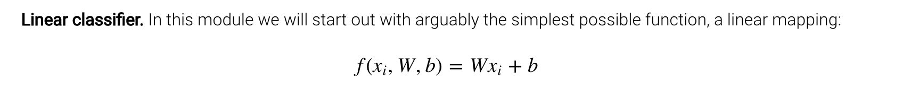
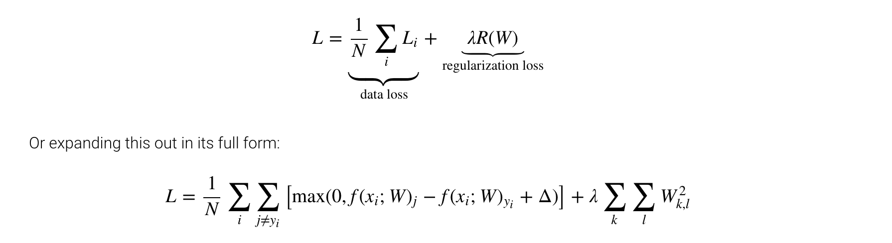
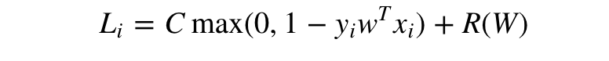
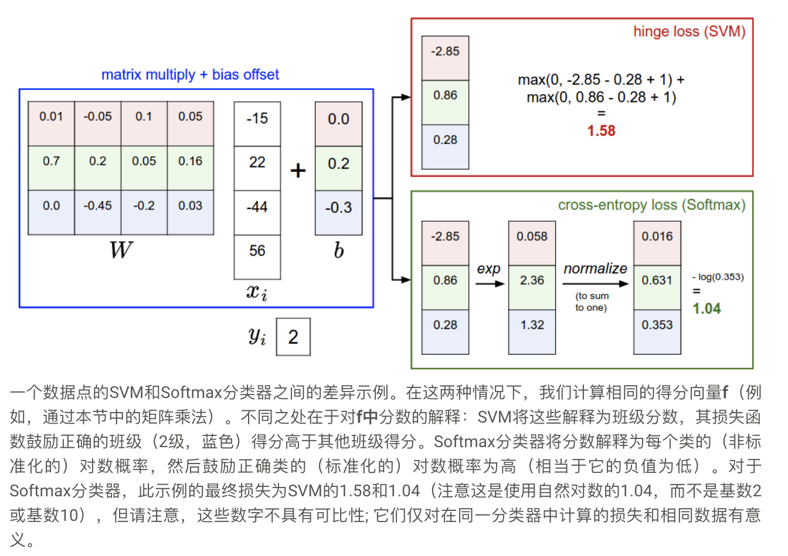

# 线性分类器



## 支持向量机

- L2正则化
- **作用是防止出现较大的超参数**
- **提高泛化能力，防止过拟合**



- 二分类SVM
- 是多分类SVM的特殊例子



## Softmax 分类器

- **概率解释**

> 可以解释为给定图像xi并由W参数化分配给正确标签yi的（标准化）概率。

```math
P(y_i \mid x_i; W) = \frac{e^{f_{y_i}}}{\sum_j e^{f_j} }
```

- **KL散度用来描述两个分布之间的差异**

> p为真实分布，q为估计分布

```math
D_{KL}(p||q)=\sum_{i=1}^np(x_i)log(\frac{p(x_i)}{q(x_i)})
```

- **KL散度变形**

```math
D_{KL}(p||q) = \sum_{i=1}^np(x_i)log(p(x_i))-\sum_{i=1}^np(x_i)log(q(x_i))
\\= -H(p(x))+[-\sum_{i=1}^np(x_i)log(q(x_i))]
```

> 前面部分为p的熵，后面的就是交叉熵
> 真实分布p的熵我们不能变化
> **我们最小化KL散度，就是最小化交叉熵**

- **真实分布p和估计分布q之间的交叉熵**

```math
H(p,q) = - \sum_x p(x) \log q(x)
```

- **交叉熵损失函数**

```math
L_i = -\log\left(\frac{e^{f_{y_i}}}{ \sum_j e^{f_j} }\right) \hspace{0.5in} \text{or equivalently} \hspace{0.5in} \\
L_i = -f_{y_i} + \log\sum_j e^{f_j}
```

> **交叉熵损失函数就是在最小化真实分布和估计分布的交叉熵**

- **数字稳定性**

> 将指数函数的指数减去一个最大值，防止溢出

```math
\frac{e^{f_{y_i}}}{\sum_j e^{f_j}}
= \frac{Ce^{f_{y_i}}}{C\sum_j e^{f_j}}
= \frac{e^{f_{y_i} + \log C}}{\sum_j e^{f_j + \log C}}
```

## 联系和区别

> 可能令人困惑的命名约定。确切地说，SVM分类器使用铰链损耗，或者有时也称为最大边际损失。该SOFTMAX分类使用交叉熵损失。Softmax分类器的名称来自softmax函数，该函数用于将原始类分数压缩为归一化为1的归一化正值，以便可以应用交叉熵损失。特别要注意的是，技术上谈论“softmax损失”是没有意义的，因为softmax只是挤压功能，但它是一种相对常用的简写。

> **正则化强度比较高的时候，较大权重会受到更多惩罚，所以权重会变小，则产生的`WX`会更小，对于softmax来说，变量绝对值减小了，则最终各个类之间结果的差异会变小。**

```math
[1, -2, 0] \rightarrow [e^1, e^{-2}, e^0] = [2.71, 0.14, 1] \rightarrow [0.7, 0.04, 0.26]
\\
[0.5, -1, 0] \rightarrow [e^{0.5}, e^{-1}, e^0] = [1.65, 0.37, 1] \rightarrow [0.55, 0.12, 0.33]
```

> 在实践中，SVM和Softmax通常具有可比性。
> SVM不关心单个分数的细节：如果它们是[10，-100，-100]或[10,9,9]，则SVM将无关紧要，因为1的余量得到满足，因此损失是零。然而，这些场景并不等同于Softmax分类器，它会为分数[10,9,9]累积比[10，-100，-100]更高的损失。
> **换句话说，Softmax分类器对它产生的分数永远不会满意：正确的类总是具有更高的概率，不正确的类总是具有更低的概率，并且损失总是会变得更好。然而，一旦边际得到满足，SVM就会感到高兴，并且它不会对超出此约束的精确分数进行微观管理。**

