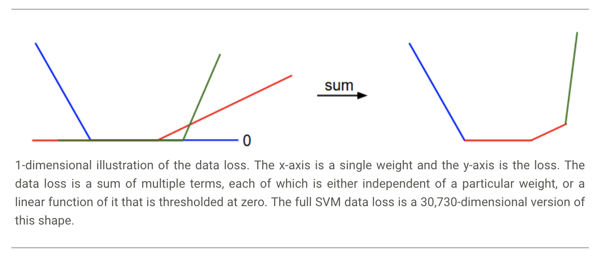
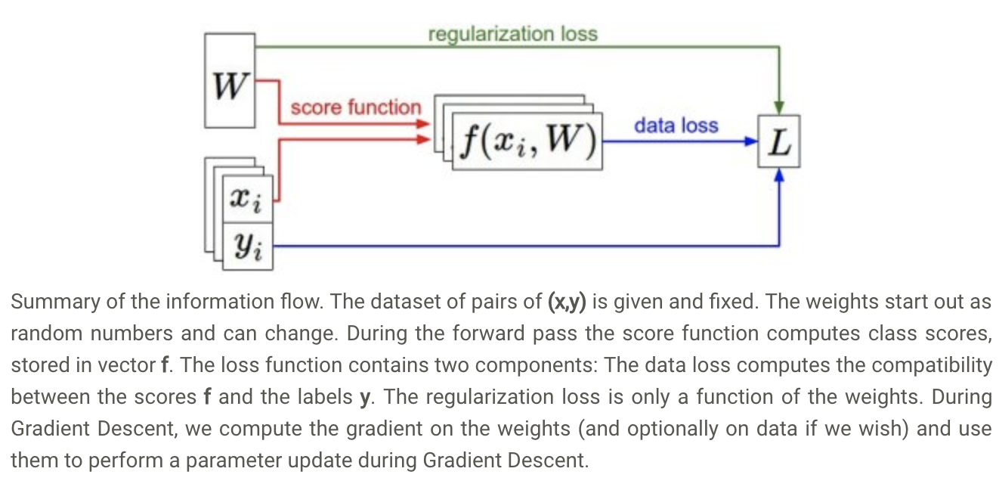

# optimization

## 可视化loss函数

- SVM的损失函数是一个**凸函数**
- 碗状外观


## 优化策略

1. 随机搜索

   - 核心理念：迭代求精。

   > 我们的策略是从随机权重开始，并随着时间的推移迭代细化它们以获得更低的损失

2. 本地搜索

    > 您可能想到的第一个策略是尝试沿着一个随机方向延伸一只脚，然后只有在它下坡时才继续

3. 遵循渐变

    > 求的是梯度，沿梯度下降方向前进

```math
\frac{df(x)}{dx} = \lim_{h\ \to 0} \frac{f(x + h) - f(x)}{h}
```

## 计算梯度

### 用有限差分数值计算梯度

```math
[f(x+h) - f(x-h)] / 2 h
```

1. 沿负梯度方向更新
2. **步长的影响**
    > 太大跨过了极低点，太小训练太慢
3. 效率问题

### 用微积分计算梯度

1. **对正确类w_i 的梯度值要累加**

    ```math
    \nabla_{w_{y_i}} L_i = - \left( \sum_{j\neq y_i} \mathbb{1}(w_j^Tx_i - w_{y_i}^Tx_i + \Delta > 0) \right) x_i
    ```

2. **对错误类w_j的梯度值不需要累加**

    ```math
    \nabla_{w_j} L_i = \mathbb{1}(w_j^Tx_i - w_{y_i}^Tx_i + \Delta > 0) x_i
    ```

## 梯度下降

1. 小批量梯度下降 Mini-batch gradient descent
2. 随机梯度下降 Stochastic Gradient Descent (SGD)


