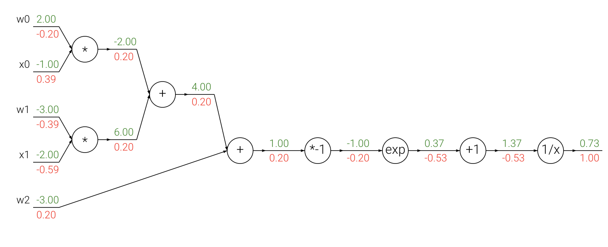
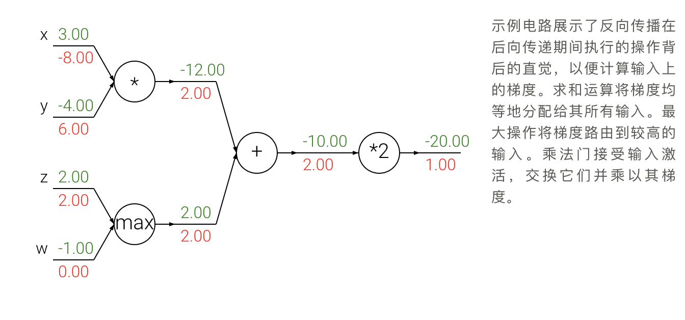

# 反向传播算法

1. 介绍
    > 这是一种通过递归应用链式规则来计算表达式渐变的方法。
2. 具有链式规则的复合表达式

    ```math
        \frac{ \partial f }{ \partial x } = \frac{ \partial f }{ \partial w1 } \frac{ \partial w1 }{ \partial x }
    ```

3. 对反向传播算法的直观理解
    > 由于链规则的这种额外乘法（对于每个输入）可以将单个且相对无用的门变成复杂电路（例如整个神经网络）中的齿轮
4. sigmod示例

    ```math
    f(w,x) = \frac{1}{1+e^{-(w_0x_0 + w_1x_1 + w_2)}}
    ```

    - 导数计算

    ```math
    f(x) = \frac{1}{x}
    \hspace{1in} \rightarrow \hspace{1in}
    \frac{df}{dx} = -1/x^2
    \\\\
    f_c(x) = c + x
    \hspace{1in} \rightarrow \hspace{1in}
    \frac{df}{dx} = 1
    \\\\
    f(x) = e^x
    \hspace{1in} \rightarrow \hspace{1in}
    \frac{df}{dx} = e^x
    \\\\
    f_a(x) = ax
    \hspace{1in} \rightarrow \hspace{1in}
    \frac{df}{dx} = a
    ```

    - 反向传播的示例

    

    - sigmod函数的导数计算

    ```math
    \sigma(x) = \frac{1}{1+e^{-x}} \\\\
    \rightarrow \hspace{0.3in} \frac{d\sigma(x)}{dx} = \frac{e^{-x}}{(1+e^{-x})^2} = \left( \frac{1 + e^{-x} - 1}{1 + e^{-x}} \right) \left( \frac{1}{1+e^{-x}} \right)
    = \left( 1 - \sigma(x) \right) \sigma(x)
    ```

    - 实施原则：分阶段反向传播
    - 缓存前向传递变量。
    - 导数值累加而不是覆盖，对应一个神经元的导数值可能有多个

5. 导数值向后流动
    
6. 矢量的梯度

    ```python
    Y = x*w + b
    dx = np.dot(dY, w.T)  # (N,D)
    dw = np.dot(X.T, dY)  # (D,M)
    db = np.sum(dY, axis=0)  # (M,)
    ```
