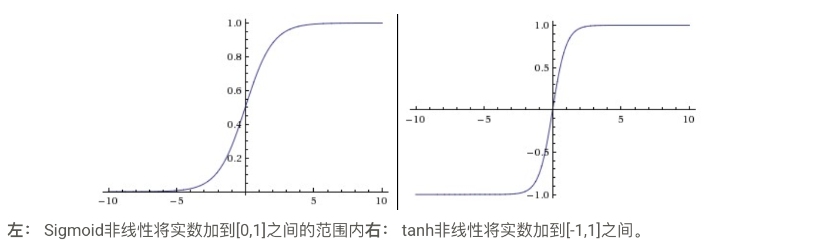
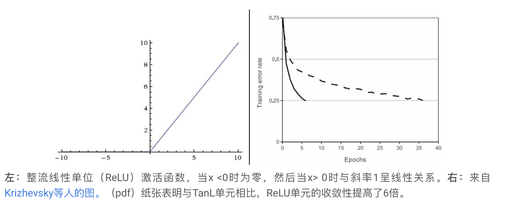
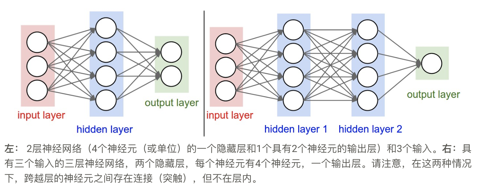
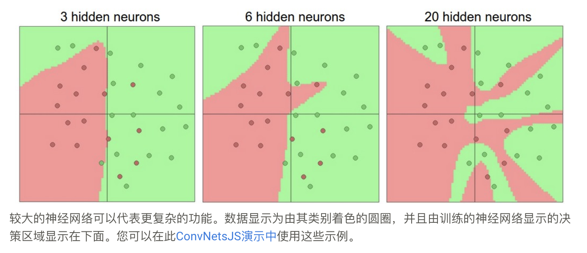

# 神经网络1

## 简单神经网络

```math
s = W_3 \max(0, W_2 \max(0, W_1 x))
```

> **注意中间的非线性激活函数非常重要，否则两个矩阵乘法可以结合，整个函数又变成了线性函数**

## 单神经元建模

### 生物学联系

- 激活函数
- sigmod函数

### 单神经元做线性分类器

- 二元SVM分类器
- 二元softmax分类器
- 正规化解释
  > 单个神经元可用于实现二元分类器（例如二进制Softmax或二进制SVM分类器）

### 激活函数

- sigmod
  
  ```math
  \theta(x)=\frac {1}{1+e^{-x} }
  ```

  1. 饱和时梯度消失
  2. 不是以0为中心

- tanh

  ```math
  tanh(x)=\frac {e^x-e^{-x}}{e^x+e^{-x}}
  ```



- ReLU
  
  ```math
    max(0,x) =
    \begin{cases}
    0,  & \text{if x $\le$ 0} \\
    x, & \text{if $x$ $\gt$ 0}
    \end{cases}
  ```

  

  1. 收敛加快
  2. 计算量少，不涉及指数函数计算
  3. 缺点：ReLU单元可以在训练期间不可逆转地死亡，因为它们可以从数据流形中被淘汰。

- leaky ReLU

  ```math
  f(x) = \mathbb{1}(x < 0) (\alpha x) + \mathbb{1}(x>=0) (x)
  ```

- Maxout

  ```math
  \max(w_1^Tx+b_1, w_2^Tx + b_2)
  ```

  1. 享有了ReLU的所有优点（线性操作方式，无饱和）
  2. 避免了"死亡"的问题
  3. 参数数量加倍，导致参数总数高

- tips
    1. 在同一网络中混合和匹配不同类型的神经元是非常罕见的，即使这样做没有根本问题。
    2. TLDR：“ 我应该使用什么神经元类型？“使用ReLU非线性，小心你的学习率，并可能监控网络中”死“单位的比例。如果这涉及到您，请尝试Leaky ReLU或Maxout。切勿使用sigmod。尝试tanh，但期望它比ReLU / Maxout更糟糕。

## 神经网络的架构

### 分层组织

- 神经网络作为图中的神经元。
  
- 命名约定。
  > **请注意，当我们说N层神经网络时，我们不计算输入层**。因此，单层神经网络描述了没有隐藏层的网络（输入直接映射到输出）。从这个意义上讲，你有时可以听到人们说逻辑回归或SVM只是单层神经网络的一个特例。您也可以听到这些网络可互换地称为“人工神经网络”（ANN）或“多层感知器”（MLP）。
- 输出层。
  > 与神经网络中的所有层不同，输出层神经元通常不具有激活功能
  > 这是因为最后的输出层通常用于表示类别得分（例如，在分类中），其是任意实值数字，或某种实值目标（例如，在回归中）。
- 调整神经网络的大小
  > 调整神经网络的大小。人们通常用来测量神经网络大小的两个指标是神经元的数量，或者更常见的是参数的数量。使用上图中的两个示例网络：

  - 第一个网络（左）有4 + 2 = 6个神经元（不计入输入），[3 x 4] + [4 x 2] = 20个权重和4 + 2 = 6个偏差，总共26个可学习参数。
  - 第二个网络（右）有4 + 4 + 1 = 9个神经元，[3 x 4] + [4 x 4] + [4 x 1] = 12 + 16 + 4 = 32个权重，4 + 4 + 1 = 9偏差，总共41个可学习的参数。

### 示例计算

  > 完全连接层的正向通过对应于一个矩阵乘法，其后是偏置偏移和激活函数。

### 神经网络的表达能力

- 具有至少一个隐藏层的神经网络是通用逼近器，换句话说，神经网络可以近似任何连续函数。
- 同样，深层网络（具有多个隐藏层）可以比单隐藏层网络更好地工作这一事实是一种经验观察，尽管它们的代表性能力是相等的。
- 在实践中通常情况下，3层神经网络将胜过2层网络，但更深层次（4,5,6层）很少有助于更多。这与卷积网络形成鲜明对比，后者已经发现深度是良好识别系统的极其重要的组成部分（例如，按照10个可学习层的顺序）。这种观察的一个论点是图像包含分层结构（例如，面部由眼睛组成，其由边缘组成等），因此若干层处理对该数据域具有直观意义。

### 设置图层数量和大小

> 请注意，随着我们增加神经网络中图层的大小和数量，网络容量会增加。也就是说，可表示功能的空间增长，因为神经元可以协作以表达许多不同的功能。

> 在上图中，我们可以看到具有更多神经元的神经网络可以表达更复杂的功能。
> **这既是一种优点（因为我们可以学习分类更复杂的数据）
> 也是一种缺点（因为它更容易过度拟合训练数据）。**
> 基于我们上面的讨论，如果数据不够复杂以防止过度拟合，似乎可以优选较小的神经网络。然而，这是不正确的————还有许多其他首选方法可以防止神经网络中的过度拟合，我们将在后面讨论（例如L2正则化，丢失，输入噪声）。在实践中，使用这些方法来控制过度拟合而不是神经元的数量总是更好。
> **较小的网络难以使用诸如梯度下降之类的局部方法进行训练：很明显，它们的损失函数具有相对较少的局部最小值，但事实证明，这些最小值中的许多更易于收敛，并且他们很糟糕（即损失很大）。相反，较大的神经网络包含明显更多的局部最小值，但这些最小值在实际损失方面变得更好。**

### 正则化控制过拟合


> 需要注意的是，你不应该使用较小的网络，因为你害怕过度拟合。相反，您应该使用与计算预算允许的一样大的神经网络，并使用其他正则化技术来控制过度拟合。
