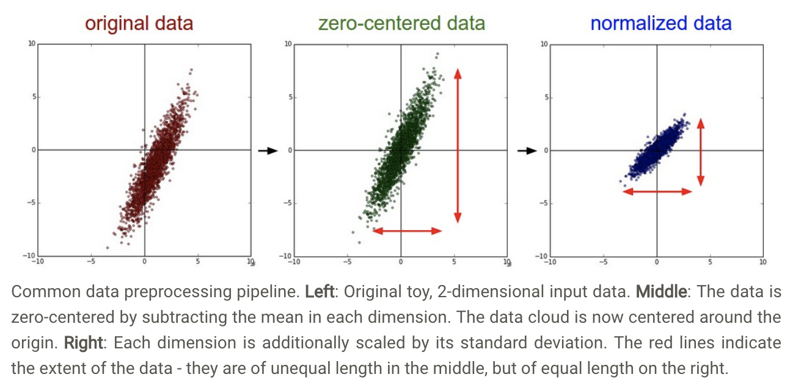
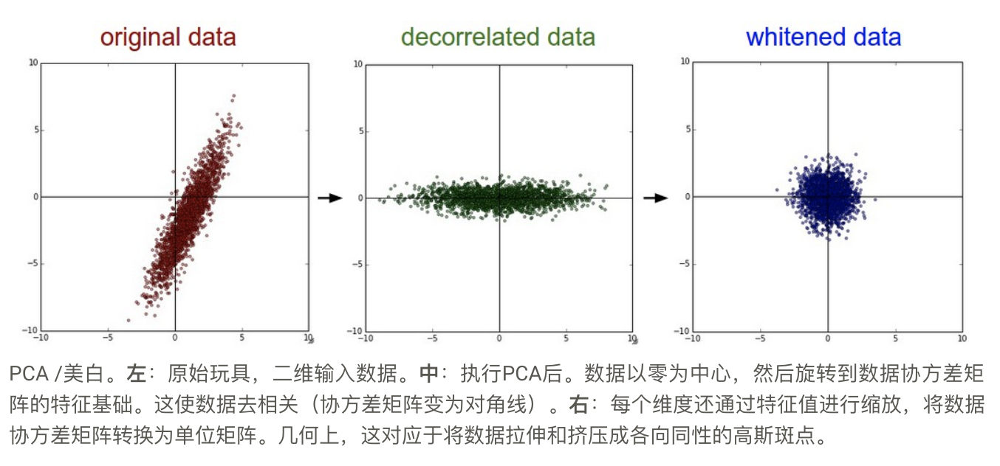
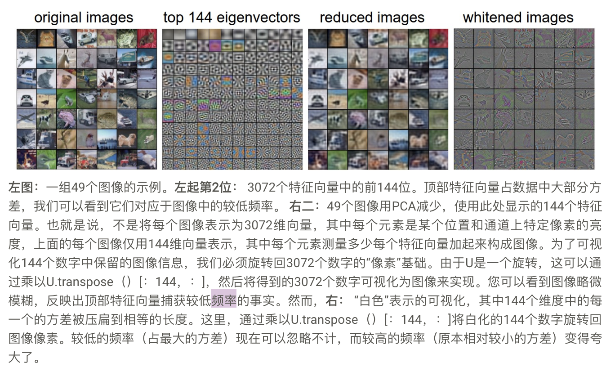

# 神经网络2

注重神经网络的静态部分的构建

## 设置数据和模型

### 数据预处理

1. 平均减法(减去像素值的平均值)
2. 标准化
    > - 指的是对每个维度都进行标准归一化
    > - 另一种形式对每个维度进行归一化，使得沿着维度的最小值和最大值分别为-1和1。
    > - **重要：只有不同维度的数据规模不一致的时候我们才有必要这样做**  (ps: 在图像的情况下，像素的相对比例已经近似相等（并且在0到255的范围内），因此不必严格地执行该额外的预处理步骤。)

    
3. PCA和白化
    - 可以计算协方差矩阵，告诉我们数据中的相关结构

    ```python
    # Assume input data matrix X of size [N x D]
    X -= np.mean(X, axis = 0) # zero-center the data (important)
    cov = np.dot(X.T, X) / X.shape[0] # get the data covariance matrix
    ```

    - 数据协方差矩阵的（i，j）元素包含数据的第i维和第j维之间的协方差。特别是，该矩阵的对角线包含方差。此外，协方差矩阵是对称的和正半正定的。我们可以计算数据协方差矩阵的SVD分解：

    ```python
    U,S,V = np.linalg.svd(cov)
    ```

    - 其中U的列是特征向量，并且S是奇异值的1-D数组。为了去除相关数据，我们将原始（但以零为中心）的数据投影到新的空间中：
    - 请注意，U的是一组正交向量（范数为1，并且彼此正交），因此它们可以被视为基础向量。因此，投影对应于数据的旋转，X使得新轴是特征向量。如果我们要计算协方差矩阵Xrot，我们会看到它现在是对角线的。`np.linalg.svd`一个很好的属性是，在其返回值中U，特征向量列按其特征值排序。**我们可以使用它来减少数据的维数，只使用前几个特征向量，并丢弃数据没有方差的维度。这有时也被称为主成分分析（PCA）降维。**

    ```python
    Xrot_reduced = np.dot(X, U[:,:100]) # Xrot_reduced becomes [N x 100]
    ```

    - **在此操作之后，我们将原始数据集[N x D]缩小为大小[N x 100]之一，保留包含最多方差的数据的100维。** 通常情况下，您可以通过在PCA减少的数据集上训练线性分类器或神经网络来获得非常好的性能，从而节省空间和时间。
    - 白化操作采用特征基础中的数据并将每个维度除以特征值以标准化比例。该变换的几何解释是，如果输入数据是多变量高斯分布，则白化数据将是具有零均值和单位协方差矩阵的高斯分布。此步骤采用以下形式：

    ```python
    # whiten the data:
    # divide by the eigenvalues (which are square roots of the singular values)
    Xwhite = Xrot / np.sqrt(S + 1e-5)
    ```

    - **警告：警告：夸大噪音。请注意，我们添加1e-5（或小常数）以防止除零。这种转换的一个弱点是它可以极大地夸大数据中的噪声，因为它将所有维度（包括主要是噪声的微小方差的无关维度）拉伸到输入中的相同大小。实际上，这可以通过更强的平滑来减轻（即，将1e-5增加为更大的数量）。**
    
    

4. 陷阱
    > 计算平均值的时候，只能使用训练集平均值，不能使用测试集数据计算平均值

### 权重初始化

1. **陷阱**：零初始化，传播相同的反向梯度（如果神经元的权重被初始化为相同，则神经元之间不存在不对称的来源。）
2. 小随机数
3. 用1 / sqrt（n）校准方差。`w = np.random.randn(n) / sqrt(n)`
   `w = np.random.randn(n) * sqrt(2,0/n)`具有ReLU神经元的神经网络的特定情况下在实践中使用的当前推荐
4. 稀疏初始化
5. 初始化偏置bias 不常见
6. 在实践中，目前的建议是使用ReLU，并使用`w = np.random.randn(n) * sqrt(2.0/n)`

### 批量标准化

  > 应用此技术通常相当于在完全连接的层（或卷积层，我们很快就会看到）之后以及非线性之前立即插入BatchNorm层
  > 在神经网络中使用批量标准化已经成为一种非常普遍的做法。实际上，使用批量标准化的网络对于错误的初始化更加健壮。另外，批量标准化可以解释为在网络的每一层进行预处理，但以可区分的方式集成到网络本身。

### 正则化

  1. L2正则化
  loss函数添加正则化项`(1/2)*lambma*W^2`
  L2正则化具有**严重惩罚峰值权重向量并且优选漫反射权向量**的直观解释。正如我们在“线性分类”部分中所讨论的，由于权重和输入之间的乘法相互作用，这具有吸引人的特性，即鼓励网络使用所有输入而不是一些输入。最后，请注意，在梯度下降参数更新期间，使用L2正则化最终意味着每个权重都线性衰减：`W += -lambda * W`朝向零。

  2. L1正则化
  弹性正则化`lambma1*|W|+lambda2*W^2`
  L1正则化导致权重向量在优化期间变得稀疏（即非常接近于零）
  实际上，如果您不关心明确的特征选择，可以期望L2正则化比L1具有更好的性能。
  3. 最大范数约束
  另一种形式的正则化是对每个神经元的权重向量的大小强制执行绝对上限，并使用预计的梯度下降来强制执行约束`||w||^2 < C`
  4. dropout
  5. 正向传播过程中的噪音主题
  其中在正向传递期间将随机的权重集合设置为零。作为预示，卷积神经网络还利用随机池，分数池和数据增量等方法利用这一主题
  6. 偏差正规化
  7. 每层正规化
  将不同的层规则化为不同的量（除了输出层之外）并不常见
  8. **实际**：常见的是使用交叉验证的单一全局L2正则化强度。将此与在所有层之后应用的丢失相结合也是常见的。一般取p=0.5。

## 损失函数

1. 分类器
   - SVM
   - Softmax
2. 问题：类的数量很大
    > 分层softmax
3. 属性分类
   > 可能有属性j可能没属性j
   > - 独立地为每个单独的属性构建二元分类器
   > - 独立地为每个属性训练逻辑回归分类器
4. 回归任务
    > **预测实际价值量的任务**，例如房屋价格或图像中某物的长度。对于此任务，通常计算预测量和真实答案之间的损失，然后测量L2平方范数或差值的L1范数。
    > **注意**: L2损失比Softmax更稳定的损耗更难以优化
    > 如果您确定分类不合适，请使用L2但要小心：例如，L2更脆弱，并且在网络中应用丢失（特别是在L2丢失之前的层中）并不是一个好主意。
    > 面对回归任务时，首先要考虑是否绝对必要。相反，我们强烈倾向于将您的产出离散化，并尽可能对其进行分类。
5. 结构化预测
    > 结构化损失是指标签可以是任意结构（例如图形，树木或其他复杂对象）的情况。 通常还假设结构的空间非常大并且不容易枚举。 结构化SVM损失背后的基本思想是要求在正确的结构yi和得分最高的错误结构之间留出余量。 将此问题解决为具有梯度下降的简单无约束优化问题并不常见。 相反，通常设计特殊求解器，以便可以利用结构空间的特定简化假设。 我们简要地提到了这个问题，但是我们认为这些细节不在课堂范围之内。
