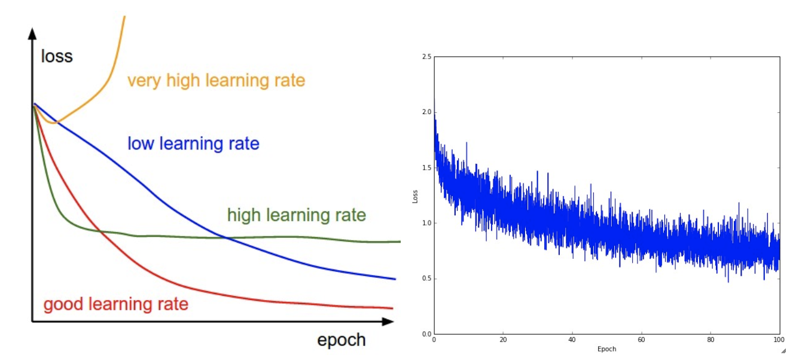

# 神经网络3

学习参数和找到好的超参数

## 1. 梯度检查

执行梯度检查就像将分析梯度与数值梯度进行比较一样简单

- 使用居中的公式
  
```math
\frac{df(x)}{dx} = \frac{f(x + h) - f(x)}{h} \hspace{0.1in} \text{(bad, do not use)}
\\
\frac{df(x)}{dx} = \frac{f(x + h) - f(x - h)}{2h} \hspace{0.1in} \text{(use instead)}
```

- 使用相对误差而不是绝对误差进行比较

    ```math
    \frac{\mid f'_a - f'_n \mid}{\max(\mid f'_a \mid, \mid f'_n \mid)}
    ```

    1. 相对误差> 1e-2通常意味着梯度可能是错误的
    2. 1e-2>相对误差> 1e-4会让你感到不舒服
    3. 对于具有扭结的目标，1e-4>相对误差通常是可以的。但如果没有扭结（例4. 如使用tanh非线性和softmax），则1e-4太高。
    4. 1e-7而你应该很开心。
    5. 还要记住，网络越深，相对错误就越高。因此，如果您对10层网络的输入数据进行梯度检查，则1e-2的相对误差可能是正常的，因为错误会在路上积累。相反，单个可微函数的1e-2误差可能表示不正确的梯度。

- 双精度计算
- 坚持活跃的浮点范围
    > 例如，在神经网络中，通常可以对批次上的损失函数进行标准化。但是，如果每个数据点的渐变非常小，那么另外将它们除以数据点的数量开始给出非常小的数字，这反过来将导致更多的数值问题。
    > 如果它们是你可能想要暂时将你的损失函数增加一个常数，以使它们达到浮点数更密集的“更好”范围 - 理想情况是大约为1.0，其浮点指数为0。
- 目标扭结问题
    > 扭结是指目标函数的不可微分部分
    > 如ReLU函数的零点
- 仅使用少量数据点。针对上述扭结问题的一个解决方法是使用更少的数据点，因为包含扭结的损失函数（例如，由于使用ReLU或margin损失等）将具有更少的扭结和更少的数据点
- 小心步长h的选择，不一定是小的更好，可能会遇到数值精度问题
- 在特征操作模式下进行梯度检查
    > 重要的是要意识到在参数空间中的特定（并且通常是随机的）单点处执行梯度检查。即使在此时梯度检查成功，也不能立即确定梯度是否在全局范围内正确实现。另外，随机初始化可能不是参数空间中最“特征”的点，并且实际上可能引入梯度似乎正确实现但不是正确实现的病理情况。
    > 因此，为了安全起见，**允许网络学习并在损失开始下降后执行梯度检查**。在第一次迭代中执行它的危险在于，这可能引入病态边缘情况并掩盖梯度的不正确实现。
- 不要让正规化损失压倒数据损失
    > 损失函数包括数据损失和正规化损失。需要注意的一个危险是正则化损失可能会压倒数据丢失，在这种情况下，梯度将主要来自正则化项，这可以掩盖数据丢失梯度的错误实现
    > 建议先关闭正则化并单独检查数据丢失，然后再将正则化项独立检测
    > 对于后者的执行包括两个方案，第一种是去除数据loss，第二种是增加正规化强度。
- 关闭dropout和数据增强
- 只检查几个维度

## 2. 完整性检查

在学习优化之前，我们需要进行一些完整性检查

1. 寻找正确的损失性能。
    > 使用小参数初始化时，请确保获得预期的损失。最好先检查数据丢失（因此将正则化强度设置为零）。例如，对于具有Softmax分类器的CIFAR-10，我们预计初始损失为2.302，因为我们期望每个类的扩散概率为0.1（因为有10个类），而Softmax损失是负的对数概率。正确的类所以：-ln（0.1）= 2.302。对于韦斯顿沃特金斯SVM，我们期望所有期望的边际都被违反（因为所有分数大约为零），因此预期损失9（因为每个错误的等级的边际为1）。如果您没有看到这些损失，则可能存在初始化问题。
2. 增加正规化强度应该增加损失
3. 过拟合一小部分数据
    > **最后也是最重要的是，在对完整数据集进行训练之前，尝试对您数据的一小部分（例如20个示例）进行培训，并确保您可以实现零loss**。对于此实验，最好将正则化设置为零，否则这可能会阻止您获得零成本。**除非您使用小数据集通过此完整性检查，否则不值得继续使用完整数据集。**请注意，您可能会遇到非常小的数据集，但仍然有不正确的实现。例如，如果您的数据点的功能由于某些错误而是随机的，则可能会过度匹配您的小型训练集，但是当您将完整数据集折叠时，您将永远不会注意到任何概括。

## 3. 学习中

### 3.1 损失函数


左图：描绘不同学习率影响的漫画。学习率低时，改进将是线性的。随着高学习率，他们将开始看起来更具指数性。较高的学习率会更快地减少损失，但是它们会陷入更糟糕的损失值（绿线）。这是因为优化中存在太多的“能量”，参数在混乱中反弹，无法在优化环境中找到一个好位置。
右图：在CIFAR-10数据集上训练小型网络时，典型损失函数随时间变化的示例。这个损失函数看起来合理(它可能表示根据其衰减速度略微过小的学习率，但很难说)，并且还表明批量大小可能有点太低(因为成本有点太高)。

**损失中的“摆动”量与批量大小有关。当批量大小为1时，摆动将相对较高。当批量大小是完整数据集时，摆动将是最小的，因为每个梯度更新应该单调地改善损失函数（除非学习率设置得太高）。**

### 3.2 train/val accuracy


### 3.3 权重的更新比

> 您可能想要跟踪的最后一个数量是更新幅度与值幅度的比率。注意：更新，而不是原始渐变（例如，在vanilla sgd中，这将是梯度乘以学习速率）。您可能希望独立地为每组参数评估和跟踪此比率。粗略的启发式是这个比例应该在1e-3左右。如果低于此值，那么学习率可能太低。如果它更高那么学习率可能太高。这是一个具体的例子：

```python
# assume parameter vector W and its gradient vector dW
param_scale = np.linalg.norm(W.ravel())
update = -learning_rate*dW # simple SGD update
update_scale = np.linalg.norm(update.ravel())
W += update # the actual update
print update_scale / param_scale # want ~1e-3
```

### 3.4 每层的激活函数和梯度分布

不正确的初始化可能会减慢甚至完全停止学习过程。幸运的是，这个问题可以相对容易地诊断出来。一种方法是为网络的所有层绘制激活/梯度直方图。直觉上，看到任何奇怪的分布并不是一个好兆头 - 例如，我们希望在整个范围[-1,1]之间看到神经元激活的分布，而不是看到所有神经元输出为零，或者全部神经元在-1或1处完全饱和。


> 神经网络的第一层的可视化权重的示例。左图：嘈杂的功能表明可能是一种症状：未融合的网络，不正确的学习率，非常低的权重正则化惩罚。右图：良好，流畅，清洁和多样化的特征是训练进展顺利的良好迹象。

## 4. 参数更新

一旦使用反向传播计算分析梯度，则使用梯度来执行参数更新。有几种方法可以执行更新，我们将在下面讨论。

### 4.1 SGD

1. vanilla update
    > 最简单的更新形式是沿负梯度方向改变参数（因为梯度表示增加的方向，但我们通常希望最小化损失函数）。假设参数x和渐变的向量dx，最简单的更新具有以下形式：

    ```python
    # Vanilla update
    x += - learning_rate * dx
    ```

2. 动量更新

    ```python
    # Momentum update
    v = mu * v - learning_rate * dx # integrate velocity
    x += v # integrate position
    ```

    > 在这里，我们看到一个v(初始化为零的变量)的介绍，以及一个额外的超参数（mu）。作为一个不幸的误称，这个变量在优化中被称为动量（其典型值约为0.9），但其物理意义与摩擦系数更为一致。实际上，这个变量会抑制速度并降低系统的动能，否则粒子永远不会停在山脚下。交叉验证时，此参数通常设置为[0.5,0.9,0.95,0.99]等值。与学习率的退火计划类似（稍后讨论），优化有时可以从动量计划中获益，动量计划在后期学习中增加动量。典型的设置是以大约0.5的动量开始并且在多个时期将其退化到0.99左右。
    > 通过Momentum更新，参数向量将在具有连续梯度的任何方向上建立速度。

3. Nesterov 动量
    > Nesterov动量背后的核心思想是当当前参数向量处于某个位置时x，然后查看上面的动量更新，我们知道单独的动量项（即忽略带梯度的第二项）即将推动参数向量通过`mu * v`。因此，如果我们要计算梯度，我们可以将未来的近似位置`x + mu * v`视为“前瞻” --这是我们即将结束的地方附近的一个点。因此，计算渐变`x + mu * v`而不是“旧/陈旧”位置是有意义的x。

    

    ```python
    x_ahead = x + mu * v
    # evaluate dx_ahead (the gradient at x_ahead instead of at x)
    v = mu * v - learning_rate * dx_ahead
    x += v
    ```

    > 但是，在实践中，人们更愿意将更新表达为与vanilla SGD或之前的动量更新类似。这可以通过使用变量变换操纵上面的更新`x_ahead = x + mu * v`，然后用`x_ahead`而不是表达更新来实现x。也就是说，我们实际存储的参数向量总是提前版本。根据`x_ahead`（但重命名为x）方程式然后变为：

    ```python
    v_prev = v # back this up
    v = mu * v - learning_rate * dx # velocity update stays the same
    x += -mu * v_prev + (1 + mu) * v # position update changes form
    ```

### 4.2 学习率退化

1. 步骤衰减
2. 指数衰减
    $$\alpha = \alpha_0 e^{-k t}$$
    a0和k为超参数，t为迭代次数
3. 1/t衰减
    $$\alpha = \alpha_0 / (1 + k t )$$
    a0和k为超参数，t为迭代次数

在实践中，我们发现步骤衰减稍微有点优选，因为它涉及的超参数（衰减的分数和以时期为单位的步长定时）比超参数k更容易理解。最后，如果你能负担得起计算预算（err衰减较慢并且训练时间较长。）

### 4.3 二阶方法

牛顿法
$$x \leftarrow x - [H f(x)]^{-1} \nabla f(x)$$
>f(x)是Hessian矩阵，它是函数的二阶偏导数的方阵，$\nabla f(x)$梯度向量。
> 直观地说，Hessian描述了损失函数的局部曲率，这使我们能够执行更有效的更新。特别地，乘以逆Hessian导致优化以在浅曲率的方向上采取更积极的步骤并且在陡曲率的方向上采取更短的步骤。请注意，重要的是，更新公式中没有任何学习率超参数，这些方法的支持者认为这是一阶方法的一大优势
> 上述更新对于大多数深度学习应用来说是不切实际的，因为以明确的形式计算（和反转）Hessian在空间和时间上都是一个非常昂贵的过程
> 然而，即使我们消除了内存问题，L-BFGS的天真应用的一大缺点是必须在整个训练集上计算，这可能包含数百万个示例。与小批量SGD不同，让L-BFGS在迷你批次上工作更加棘手，也是一个活跃的研究领域。
> 在实践中，目前通常不会将L-BFGS或类似的二阶方法应用于大规模深度学习和卷积神经网络。相反，基于（Nesterov）动量的SGD变体更为标准，因为它们更简单，更容易扩展。

### 4.4 每层自适应学习率方法

到目前为止，我们讨论过的所有先前方法都在全局范围内操纵学习率，并且对所有参数均等。调整学习率是一个昂贵的过程，因此在设计能够自适应地调整学习速率的方法方面做了很多工作，甚至每个参数都这样做。这些方法中的许多方法可能仍然需要其他超参数设置，但其论点是它们对于比原始学习速率更广泛的超参数值表现良好。

1. Adagrad

    ```python
    # Assume the gradient dx and parameter vector x
    cache += dx**2
    x += - learning_rate * dx / (np.sqrt(cache) + eps)
    ```

    > 请注意，变量的cache大小等于渐变的大小，并跟踪每个参数的平方渐变和。然后，这用于按元素方式标准化参数更新步骤。请注意，**接收高梯度的权重将降低其有效学习率，而接收较少或不经常更新的权重将使其有效学习率增加**。有趣的是，平方根操作变得非常重要，没有它，算法执行得更糟。平滑项eps（通常设置在1e-4到1e-8的范围内）避免除以零。
    > **Adagrad的一个缺点是，在深度学习的情况下，单调学习率通常证明过于激进并且过早地停止学习。**
2. RMSprop
    RMSProp更新以非常简单的方式调整Adagrad方法，以尝试降低其积极的，单调递减的学习速率。特别是，它使用平方梯度的移动平均值，

    ```python
    cache = decay_rate * cache + (1 - decay_rate) * dx**2
    x += - learning_rate * dx / (np.sqrt(cache) + eps)
    ```

    这里，decay_rate是一个超参数，典型值是[0.9,0.99,0.999]。请注意，x+=更新与Adagrad相同，但cache变量被弱化了。因此，RMSProp仍然基于其梯度的大小来调制每个权重的学习速率，这具有有益的均衡效果，但是与Adagrad不同，更新不会单调地变小。
3. Adam
    看起来像RMSprop的动量版本

    ```python
    m = beta1*m + (1-beta1)*dx
    v = beta2*v + (1-beta2)*(dx**2)
    x += - learning_rate * m / (np.sqrt(v) + eps)
    ```

    请注意，更新看起来与RMSProp更新完全相同，除了m使用渐变的“平滑”版本而不是原始（可能是有噪声的）渐变向量dx。**在本文推荐值是eps = 1e-8，beta1 = 0.9，beta2 = 0.999。** 实际上，Adam目前被推荐作为默认算法使用，并且通常比RMSProp稍好一些。然而，通常也值得尝试SGD + Nesterov Momentum作为替代方案。完整的Adam更新还包括偏差校正机制，该机制补偿了这样的事实：在最初的几个时间步骤中，矢量m,v被初始化并因此在它们完全“预热”之前偏置为零。使用偏差校正机制，更新如下

    ```python
    # t is your iteration counter going from 1 to infinity
    m = beta1*m + (1-beta1)*dx
    mt = m / (1-beta1**t)
    v = beta2*v + (1-beta2)*(dx**2)
    vt = v / (1-beta2**t)
    x += - learning_rate * mt / (np.sqrt(vt) + eps)
    ```

    
    

## 5. 超参数优化

常见超参数包括

1. 初始学习率
2. 学习率衰减时间表（如衰减常数）
3. 正则化强度（L2惩罚，dropout强度）
4. 其他不敏感参数，例如在每个参数的自适应学习方法，动量的设置及其时间表等。

### 5.1 实现

较大的神经网络通常需要很长时间来训练，因此执行超参数搜索可能需要很多天/周。记住这一点非常重要，因为它会影响代码库的设计。一个特定的设计是让工作人员连续采样随机超参数并执行优化。在训练期间，工作人员将在每个时期之后跟踪验证性能，并将模型检查点（以及诸如随时间的损失的各种训练统计信息）写入文件，优选地在共享文件系统上。**将验证性能直接包含在文件名中非常有用，因此检查和排序进度很简单。**然后是第二个程序，我们称之为主人，它可以在计算集群中启动或杀死工人，还可以检查工人编写的检查点并绘制他们的培训统计数据等。

### 5.2 首选一个验证折叠以进行交叉验证

在大多数情况下，可观大小的单个验证集大大简化了代码库，**而无需使用多个折叠进行交叉验证。** 你会听到人们说他们“交叉验证”了一个参数，但很多时候人们都认为他们仍然只使用了一个验证集。

### 5.3 超参数的范围

在对数刻度上搜索超参数。例如，学习率的典型抽样如下：learning_rate = 10 ** uniform(-6, 1)。也就是说，我们从均匀分布中生成一个随机数，然后将其提升到10的幂。同样的策略应该用于正则化强度。直觉上，这是因为学习率和正则化强度对训练动力学具有乘法效应。例如，如果学习率为0.001，则对学习率加0.01的固定变化会对动态产生巨大影响，但如果学习率为10时几乎没有影响。这是因为学习率乘以计算的梯度更新。因此，**考虑将学习率乘以或除以某个值的范围比将某个值加上或减去的学习率的范围更自然**。通常以原始比例搜索一些参数（例如，dropout）（例如，dropout = uniform(0,1)）。

### 5.4 首选随机搜索到网格搜索

随机选择的试验对于超参数优化比在网格上的试验更有效


### 5.5 小心边界上的最优值

有时，您可能会在不良范围内搜索超参数（例如学习率）。例如，假设我们使用learning_rate = 10 ** uniform(-6, 1)。一旦我们收到结果，重要的是要仔细检查最终学习率是否不在此间隔的边缘，否则您可能会错过超出间隔的更优化的超参数设置。

### 5.6 将您的搜索从粗略变为精细

对更精细的参数搜索，使用更多的epoch。
在实践中，首先搜索粗略范围（例如10 ** [ - 6,1]），然后根据最佳结果出现的位置，缩小范围可能会有所帮助。此外，执行初始粗略搜索同时仅训练1个纪元甚至更少，这可能是有帮助的，因为许多超参数设置可能导致模型根本不学习，或者立即以无限的成本爆炸。然后第二阶段可以用5个epoch执行更窄的搜索，并且最后阶段可以在更多epoch的最终范围内执行详细搜索。

### 5.7 贝叶斯超参数优化

## 6. 评估

### 6.1 模型集

一种将神经网络性能提高几个百分点的可靠方法是**训练多个独立模型**，并在测试时平均预测。随着整体中模型的数量增加，性能通常会单调改善（尽管收益递减）

1. 相同的模型，不同的初始化。
    > 使用交叉验证来确定最佳超参数，然后使用最佳超参数集训练多个模型，但使用不同的随机初始化。这种方法的危险在于变化只是由于初始化。
2. 在交叉验证期间发现的顶级模型。
    > 使用交叉验证来确定最佳超参数，然后选择前几个（例如10个）模型来形成整体。这改善了整体的多样性，但存在包括次优模型的危险。在实践中，这可以更容易执行，因为在交叉验证之后不需要额外的模型再训练
3. 单个模型的不同检查点。
    > 如果训练非常昂贵，那么有些人在一段时间内（例如在每个epoch之后）采用单个网络的不同检查点并使用这些检查点形成模型集合。显然，缺乏多样性，但在实践中仍然可以很好地运作。这种方法的优点是非常便宜。
4. 在训练期间运行平均参数。
    > 与最后一点相关，几乎总是获得额外的一两个性能的廉价方法是在内存中维持网络权重的第二个副本，其在训练期间保持指数衰减的先前权重之和。这样，您可以在最后几次迭代中平均网络状态。您会发现，在最后几步中，这种“平滑”的权重版本几乎总能获得更好的验证错误。要记住的粗略直觉是目标是碗状的，你的网络在模式中跳跃，所以平均值有更高的机会在更接近模式的地方。

模型集合的一个缺点是它们需要更长的时间来评估测试示例。感兴趣的读者可能会发现Geoff Hinton最近的作品对“黑暗知识”的启发，其中的想法是通过将整体对数可能性纳入修改后的目标，将一个好的集合“提炼”回单个模型。
