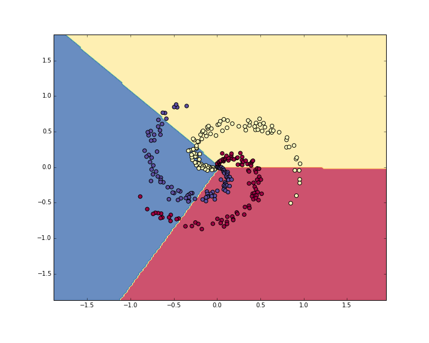

# put it together

在本节中，我们将介绍二维玩具神经网络的完整实现。我们首先实现一个简单的线性分类器，然后将代码扩展到一个2层神经网络。正如我们所看到的，这个扩展非常简单，只需要很少的更改。

## 1. 数据生成

```python
N = 100 # number of points per class
D = 2 # dimensionality
K = 3 # number of classes
X = np.zeros((N*K,D)) # data matrix (each row = single example)
y = np.zeros(N*K, dtype='uint8') # class labels
for j in xrange(K):
  ix = range(N*j,N*(j+1))
  r = np.linspace(0.0,1,N) # radius
  t = np.linspace(j*4,(j+1)*4,N) + np.random.randn(N)*0.2 # theta
  X[ix] = np.c_[r*np.sin(t), r*np.cos(t)]
  y[ix] = j
# lets visualize the data:
plt.scatter(X[:, 0], X[:, 1], c=y, s=40, cmap=plt.cm.Spectral)
plt.show()
```


> 玩具螺旋数据由三个类别（蓝色，红色，黄色）组成，这些类别不是线性可分的。

通常我们希望预处理数据集，以便每个要素的均值和单位标准差均为零，但在这种情况下，要素已经在从-1到1的良好范围内，因此我们跳过此步骤。

## 2. 训练softmax分类器

### 2.1 初始化权重参数

让我们首先在这个分类数据集上训练一个Softmax分类器。正如我们在前面部分中看到的，Softmax分类器具有线性分数函数并使用交叉熵损失。线性分类器的参数由权重矩阵W和b每个类的偏置向量组成。让我们首先将这些参数初始化为随机数：

```python
# initialize parameters randomly
W = 0.01 * np.random.randn(D,K)
b = np.zeros((1,K))
```

我们`D = 2`是维度，`K = 3`是类的数量。

### 2.2 计算类的分数

```python
# compute class scores for a linear classifier
scores = np.dot(X, W) + b
```

在这个例子中，我们有300个2-D点，所以在这个乘法之后，数组scores将具有`[300 x 3]`的大小，其中每行给出对应于3个类（蓝色，红色，黄色）的类分数。

### 2.3 计算损失

$$L =  \underbrace{ \frac{1}{N} \sum_i L_i }_\text{data loss} + \underbrace{ \frac{1}{2} \lambda \sum_k\sum_l W_{k,l}^2 }_\text{regularization loss} \\\\$$

鉴于`scores`我们上面计算的数组，我们可以计算损失。首先，获得概率的方法是直截了当的：

```python
num_examples = X.shape[0]
# get unnormalized probabilities
exp_scores = np.exp(scores)
# normalize them for each example
probs = exp_scores / np.sum(exp_scores, axis=1, keepdims=True)
```

我们现在有一个probs大小为`[300 x 3]`的数组，其中每行现在包含类的概率。特别是，因为我们已将它们标准化，现在每一行总和为1。我们现在可以在每个示例中查询分配给正确类的log概率：

```python
correct_logprobs = -np.log(probs[range(num_examples),y])
```

**该数组correct_logprobs是一维数组，仅包含为每个示例分配给正确类的概率。那么完全损失就是这些对数概率和正则化损失的平均值：**

```python
# compute the loss: average cross-entropy loss and regularization
data_loss = np.sum(correct_logprobs)/num_examples
reg_loss = 0.5*reg*np.sum(W*W)
loss = data_loss + reg_loss
```

在此代码中，正则化强度λ存储在里面reg。0.5倍正规化的好处是将在一秒钟内变得清晰。在开始时（使用随机参数）对此进行评估可能会给我们带来这样的情况loss = 1.1，即np.log(1.0/3)，由于初始随机权重较小，分配给所有类的所有概率都约为三分之一。我们现在希望将损失尽可能地降低，loss = 0作为绝对下限。但损失越低，分配给所有示例的正确类的概率越高。

### 2.4 用反向传播计算分析梯度

损失函数
$$p_k = \frac{e^{f_k}}{ \sum_j e^{f_j} } \hspace{1in} L_i =-\log\left(p_{y_i}\right)$$
梯度值的计算
$$\frac{\partial L_i }{ \partial f_k } = p_k - \mathbb{1}(y_i = k)$$
> **注意这个表达式是多么优雅和简单。假设我们计算的概率是p = [0.2, 0.3, 0.5]，并且正确的类是中间的（概率为0.3）。根据这种推导，得分的梯度将是df = [0.2, -0.7, 0.5]**
> 回想一下梯度的解释，我们看到这个结果非常直观：增加得分向量的第一个或最后一个元素f（错误类别的得分）会导致损失增加（由于正面符号+0.2和+ 0.5） - 正如预期的那样增加损失是不好的。但是，增加正确班级的分数会对损失产生负面影响。-0.7的梯度告诉我们，增加正确的课程分数会导致损失loss的减少，这是有道理的。

所有这些归结为以下代码。回想一下，`probs`存储每个示例的所有类（作为行）的概率。为了得到我们称之为分数的梯度`dscores`，我们按如下方式进行：

```python
dscores = probs
dscores[range(num_examples),y] -= 1
dscores /= num_examples
```

最后，我们有这样的`scores = np.dot(X, W) + b`，所以与`scores`的梯度（存储在`dscores`），我们现在可以反向传播成W和b：

```python
dW = np.dot(X.T, dscores)
db = np.sum(dscores, axis=0, keepdims=True)
dW += reg*W # don't forget the regularization gradient
```

### 2.5 执行参数更新

现在我们已经评估了梯度，我们知道每个参数如何影响损失函数。我们现在将在负梯度方向上执行参数更新以减少loss：

```python
# perform a parameter update
W += -step_size * dW
b += -step_size * db
```

### 2.6 训练

```python
#Train a Linear Classifier

# initialize parameters randomly
W = 0.01 * np.random.randn(D,K)
b = np.zeros((1,K))

# some hyperparameters
step_size = 1e-0
reg = 1e-3 # regularization strength

# gradient descent loop
num_examples = X.shape[0]
for i in xrange(200):
  
  # evaluate class scores, [N x K]
  scores = np.dot(X, W) + b
  
  # compute the class probabilities
  exp_scores = np.exp(scores)
  probs = exp_scores / np.sum(exp_scores, axis=1, keepdims=True) # [N x K]
  
  # compute the loss: average cross-entropy loss and regularization
  correct_logprobs = -np.log(probs[range(num_examples),y])
  data_loss = np.sum(correct_logprobs)/num_examples
  reg_loss = 0.5*reg*np.sum(W*W)
  loss = data_loss + reg_loss
  if i % 10 == 0:
    print "iteration %d: loss %f" % (i, loss)
  
  # compute the gradient on scores
  dscores = probs
  dscores[range(num_examples),y] -= 1
  dscores /= num_examples
  
  # backpropate the gradient to the parameters (W,b)
  dW = np.dot(X.T, dscores)
  db = np.sum(dscores, axis=0, keepdims=True)
  
  dW += reg*W # regularization gradient
  
  # perform a parameter update
  W += -step_size * dW
  b += -step_size * db
```

运行它打印输出：

```shell
iteration 0: loss 1.096956
iteration 10: loss 0.917265
iteration 20: loss 0.851503
iteration 30: loss 0.822336
iteration 40: loss 0.807586
iteration 50: loss 0.799448
iteration 60: loss 0.794681
iteration 70: loss 0.791764
iteration 80: loss 0.789920
iteration 90: loss 0.788726
iteration 100: loss 0.787938
iteration 110: loss 0.787409
iteration 120: loss 0.787049
iteration 130: loss 0.786803
iteration 140: loss 0.786633
iteration 150: loss 0.786514
iteration 160: loss 0.786431
iteration 170: loss 0.786373
iteration 180: loss 0.786331
iteration 190: loss 0.786302
```

我们看到在大约190次迭代之后我们已经收敛了。我们可以评估训练集的准确性：

```python
# evaluate training set accuracy
scores = np.dot(X, W) + b
predicted_class = np.argmax(scores, axis=1)
print 'training accuracy: %.2f' % (np.mean(predicted_class == y))
```

49％。不是很好，但也不足为奇，因为数据集的构造使得它不是线性可分的。我们还可以绘制学习的决策边界.


## 3. 训练神经网络

显然，线性分类器不适合此数据集，我们希望使用神经网络。一个额外的隐藏层就足够了这个玩具数据。我们现在需要两组权重和偏差（第一层和第二层）：

```python
# initialize parameters randomly
h = 100 # size of hidden layer
W = 0.01 * np.random.randn(D,h)
b = np.zeros((1,h))
W2 = 0.01 * np.random.randn(h,K)
b2 = np.zeros((1,K))
```

计算score的前向传递现在改变形式：

```python
# evaluate class scores with a 2-layer Neural Network
hidden_layer = np.maximum(0, np.dot(X, W) + b) # note, ReLU activation
scores = np.dot(hidden_layer, W2) + b2
```

其他一切都是一样的。我们完全像以前一样基于得分计算损失，并且像以前一样获得得分的梯度dscores。然而，我们将该梯度反向传播到模型参数的方式现在改变了形式。首先让我们反向传播神经网络的第二层。这看起来与我们对Softmax分类器的代码相同，除了我们用X变量替换（原始数据hidden_layer）：

```python
# backpropate the gradient to the parameters
# first backprop into parameters W2 and b2
dW2 = np.dot(hidden_layer.T, dscores)
db2 = np.sum(dscores, axis=0, keepdims=True)
```

但是，不像以前我们还没有完成，因为hidden_layer它本身就是其他参数和数据的函数！我们需要通过这个变量继续反向传播。其梯度可以计算为：

```python
dhidden = np.dot(dscores, W2.T)
```

现在我们在隐藏层的输出上有渐变。接下来，我们必须反向传播ReLU非线性。事实证明这很容易，因为ReLU在后向传递期间实际上是一个开关。自从$r = max(0, x)$，我们有$\frac{dr}{dx} = 1(x > 0)$。结合链规则，我们看到ReLU单位让渐变在输入大于0时不变，但如果在前向传递过程中输入小于零则杀死它。因此，我们可以简单地用以下方式反向传播ReLU：

```python
# backprop the ReLU non-linearity
dhidden[hidden_layer <= 0] = 0
```

现在我们终于继续第一层权重和偏见：

```python
# finally into W,b
dW = np.dot(X.T, dhidden)
db = np.sum(dhidden, axis=0, keepdims=True)
```

我们完成了！我们有渐变`dW,db,dW2,db2`，可以执行参数更新。其他一切都保持不变。完整代码看起来非常相似：

```python
# initialize parameters randomly
h = 100 # size of hidden layer
W = 0.01 * np.random.randn(D,h)
b = np.zeros((1,h))
W2 = 0.01 * np.random.randn(h,K)
b2 = np.zeros((1,K))

# some hyperparameters
step_size = 1e-0
reg = 1e-3 # regularization strength

# gradient descent loop
num_examples = X.shape[0]
for i in xrange(10000):
  
  # evaluate class scores, [N x K]
  hidden_layer = np.maximum(0, np.dot(X, W) + b) # note, ReLU activation
  scores = np.dot(hidden_layer, W2) + b2
  
  # compute the class probabilities
  exp_scores = np.exp(scores)
  probs = exp_scores / np.sum(exp_scores, axis=1, keepdims=True) # [N x K]
  
  # compute the loss: average cross-entropy loss and regularization
  correct_logprobs = -np.log(probs[range(num_examples),y])
  data_loss = np.sum(correct_logprobs)/num_examples
  reg_loss = 0.5*reg*np.sum(W*W) + 0.5*reg*np.sum(W2*W2)
  loss = data_loss + reg_loss
  if i % 1000 == 0:
    print "iteration %d: loss %f" % (i, loss)
  
  # compute the gradient on scores
  dscores = probs
  dscores[range(num_examples),y] -= 1
  dscores /= num_examples
  
  # backpropate the gradient to the parameters
  # first backprop into parameters W2 and b2
  dW2 = np.dot(hidden_layer.T, dscores)
  db2 = np.sum(dscores, axis=0, keepdims=True)
  # next backprop into hidden layer
  dhidden = np.dot(dscores, W2.T)
  # backprop the ReLU non-linearity
  dhidden[hidden_layer <= 0] = 0
  # finally into W,b
  dW = np.dot(X.T, dhidden)
  db = np.sum(dhidden, axis=0, keepdims=True)
  
  # add regularization gradient contribution
  dW2 += reg * W2
  dW += reg * W
  
  # perform a parameter update
  W += -step_size * dW
  b += -step_size * db
  W2 += -step_size * dW2
  b2 += -step_size * db2
```

打印

```shell
iteration 0: loss 1.098744
iteration 1000: loss 0.294946
iteration 2000: loss 0.259301
iteration 3000: loss 0.248310
iteration 4000: loss 0.246170
iteration 5000: loss 0.245649
iteration 6000: loss 0.245491
iteration 7000: loss 0.245400
iteration 8000: loss 0.245335
iteration 9000: loss 0.245292
```

```python
# evaluate training set accuracy
hidden_layer = np.maximum(0, np.dot(X, W) + b)
scores = np.dot(hidden_layer, W2) + b2
predicted_class = np.argmax(scores, axis=1)
print 'training accuracy: %.2f' % (np.mean(predicted_class == y))
```

98％！我们还可以看出决策边界.

