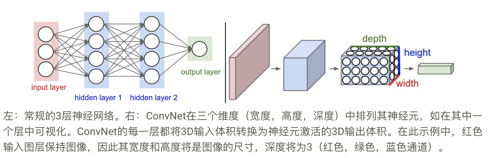
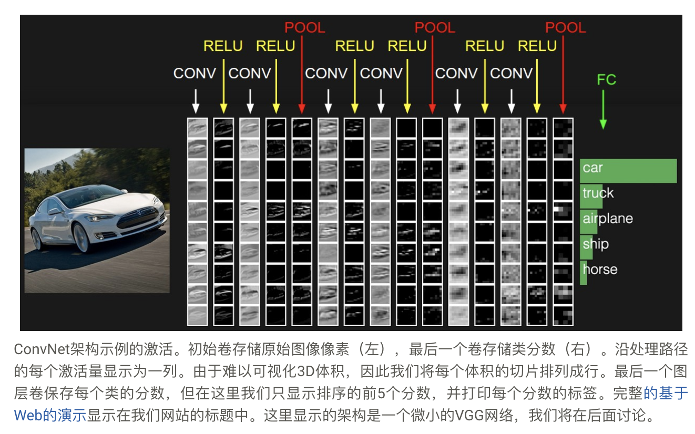
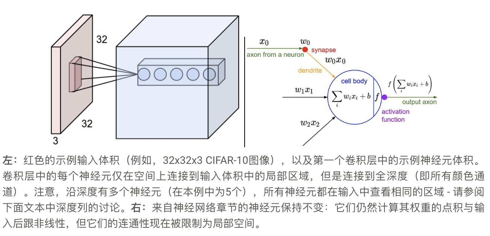
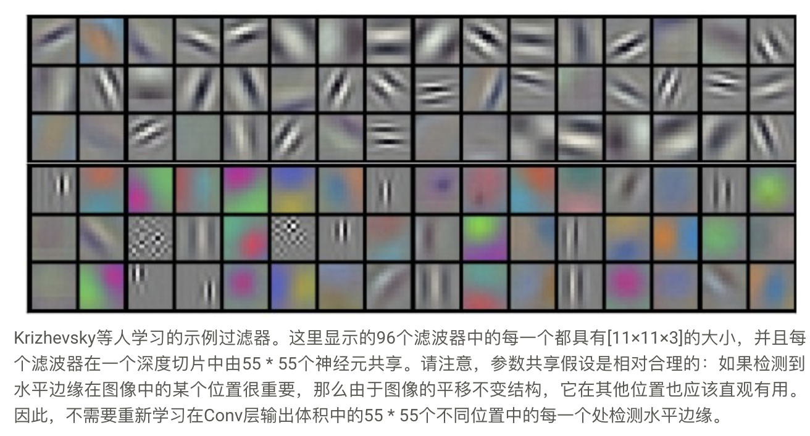
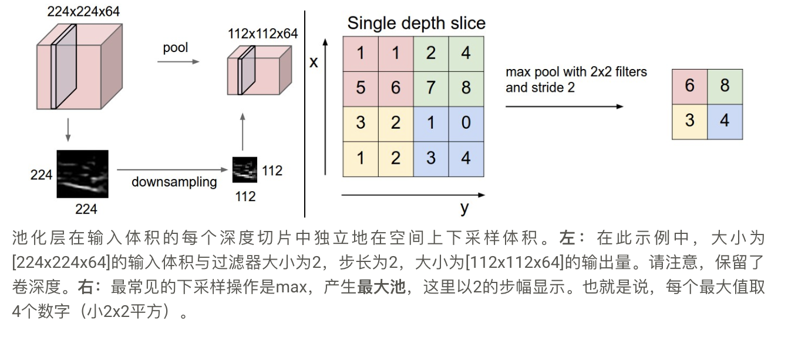

# 卷积神经网络

CNN和神经网络非常相似，**不同的地方在于CNN明确输入为图像**，允许我们将某些属性编码到架构中，这样前向传播函数能够更加有效的实现，并且**大大减少参数的数量。**

## 1. 架构概述

常规神经网络：每个隐藏层由一组神经元组成，其中每个神经元完全连接到前一层中的所有神经元，并且单个层中的神经元完全独立地起作用并且不共享任何连接。

常规神经网络无法很好地扩展到完整图像。在CIFAR-10中，图像尺寸仅为32x32x3（32个宽，32个高，3个颜色通道），因此在常规神经网络的第一个隐藏层中的单个完全连接的神经元将具有32 \* 32 \*3 = 3072个权重。
这个数量似乎仍然可以控制，但显然**这种完全连接的结构不能扩展到更大的图像**。例如，更可观的尺寸的图像，例如200x200x3，将导致具有200 \* 200 \* 3 = 120,000个权重的神经元。而且，我们几乎肯定会想要几个这样的神经元，所以参数会很快加起来！显然，**这种完全连接是浪费的，而且大量参数很快就会导致过度拟合。**

3D体积的神经元：卷积神经网络利用输入由图像组成的事实，并以更合理的方式约束架构。

特别是，与常规神经网络不同，**ConvNet的各层具有三维排列的神经元：宽度，高度，深度。**（注意单词深度这里指的是激活体积的第三维，而不是完整神经网络的深度，它可以指网络中的总层数。）例如，CIFAR-10中的输入图像是输入体积激活，体积的尺寸为32x32x3（宽度，高度，深度）。正如我们将很快看到的那样，**层中的神经元只会在它之前连接到层的一个小区域，而不是以完全连接的方式连接到所有神经元。**



## 2. CNN的各个神经层

如上所述，简单的ConvNet是一系列层，ConvNet的每一层都通过可微函数将一个激活量转换为另一个。我们使用三种主要类型的层来构建ConvNet架构：**卷积层，池化层和完全连接层**（完全连接层 就是常规神经网络中所见的神经层）。我们将堆叠这些层以形成完整的ConvNet**架构**。

示例架构：CIFAR-10分类的简单ConvNet可以具有架构`[INPUT-CONV-RELU-POOL-FC]`。

- INPUT [32x32x3]
    将保持图像的原始像素值，在这种情况下是宽度为32，高度为32且具有三个颜色通道R，G，B的图像。
- CONV层
    计算连接到输入中的局部区域的神经元的输出，每个神经元计算它们的权重与它们在输入体积中连接的小区域之间的点积。如果我们决定使用12个过滤器，这可能会导致诸如[32x32x12]的体积。
- RELU层
    应用激活函数，例如$max(0,x)$，阈值为零。这使得体积的大小保持不变（[32x32x12]）。
- POOL层
    将沿空间维度（宽度，高度）执行下采样操作，从而产生诸如[16x16x12]的体积。
- FC(即完全连接层)
    计算类别得分，导致大小的体积[1x1x10]，其中10个数字中的每一个对应于类别得分，例如10个类别的CIFAR-10。与普通的神经网络一样，顾名思义，该层中的每个神经元都将连接到前一层中的所有神经元。

请注意，某些图层包含参数而其他图层则不包含。特别地，CONV / FC层执行的变换不仅是输入的激活函数，还是参数（神经元的权重和偏差）的函数。另一方面，**RELU / POOL层将实现固定功能。CONV / FC层中的参数将使用梯度下降进行训练**，以便ConvNet计算的类得分与每个图像的训练集中的标签一致。

ConvNet架构在最简单的情况下是一个层的列表，它将图像卷转换为输出体积。

- 有几种不同类型的图层（CONV / FC / RELU / POOL是目前最受欢迎的）
- 每个图层都接受输入3D体积，并通过可微分函数将其转换为输出3D体积
- 每个层可能有也可能没有参数（CONV / FC 有，RELU / POOL没有）
- 每个层可能有也可能没有额外的超参数（CONV / FC / POOL有，RELU没有）



### 2.1 卷积层

卷积层完成大部分计算繁重的工作

我们将每个神经元连接到输入体积的局部区域。这种连接的空间范围是一个超参数，称为神经元的感受野（相当于这是滤波器大小）。沿深度轴的连通程度始终等于输入体积的深度。重要的是再次强调我们如何处理空间维度（宽度和高度）和深度维度的不对称性：连接在空间中是局部的（沿宽度和高度），但始终沿输入体积的整个深度覆盖。

- 例1。例如，假设输入体积大小为[32x32x3]，（例如RGB CIFAR-10图像）。如果感受野（或滤波器大小）是5x5，那么Conv层中的每个神经元将具有输入体积中[5x5x3]区域的权重，总共5 \* 5 \* 3 = 75个权重（和+1）偏见参数）。请注意，沿深度轴的连接范围必须为3，因为这是输入体积的深度。
- 例2。假设输入体积大小为[16x16x20]。然后使用3x3的示例感受区域大小，Conv层中的每个神经元现在将具有到输入体积的总共3 \* 3 \* 20 = 180个连接。请注意，同样，连接在空间中是局部的（例如3x3），但在输入深度（20）处是完整的。


三个超参数控制输出体积的大小：深度，步幅和零填充。我们接下来讨论这些：

- 首先，输出体积的深度是一个超参数：**它对应于我们想要使用的滤波器的数量**，每个都学习在输入中寻找不同的东西。
- 其次，我们必须指定我们**滑动过滤器的步幅**。当步幅为1时，我们一次移动滤波器一个像素。当步幅为2（或者不常见为3或更多时，虽然这在实践中很少见），然后当我们滑动它们时，滤波器一次跳跃2个像素。这将在空间上产生较小的输出量。
- 正如我们将很快看到的那样，有时在边界周围用零填充输入体积会很方便。这个零填充的大小是一个超参数。零填充的一个很好的特性是它允许我们控制输出体积的空间大小（最常见的是我们很快就会看到它会用它来精确地保留输入体积的空间大小，以便输入和输出宽度和高度是一样的）。

设输入体积大小为W，滤波器大小为F，步长S，填充为P，输出神经元大小为$(W - F + 2P)/S + 1$
例如，输入7\*7，步幅1，填充0，过滤器3\*3，输出为5\*5
步幅为2，输出为3\*3。

**使用零填充** 一般使用$P = (F - 1)/2，S = 1$，让输入体积和输出体积的高度和宽度相同。
**步长的限制** $W=10,P=0,F=3$我们就不可能使用$S=2$，因为$(W-F+2*P)/S+1 = 4.5$，不能取一个非整数。

**参数共享**。参数共享方案用于卷积层以控制参数的数量。使用上面的真实示例，我们看到第一个Conv层中有55 \* 55 \* 96 = 290,400个神经元，每个神经元有11 \* 11 \* 3 = 363个权重和1个偏差。总之，这仅在ConvNet的第一层上增加了290400 * 364 = 105,705,600个参数。显然，这个数字非常高。

事实证明，通过做出一个合理的假设，我们可以大大减少参数的数量：如果一个特征对于在某个空间位置（x，y）计算是有用的，那么在不同位置计算它也应该是有用的（x2 ，y2）上。换句话说，将单个二维深度切片表示为深度切片（例如，体积大小[55x55x96]有96个深度切片，每个切片大小为[55x55]），我们将限制每个深度切片中的神经元使用相同的权重和偏差。使用此参数共享方案，我们示例中的第一个Conv层现在只有96个唯一权重集（每个深度切片一个），总共96 \* 11 \* 11 \* 3 = 34,848个唯一权重，或34,944个参数（ +96偏置）。或者，每个深度切片中的所有55 * 55个神经元现在将使用相同的参数。在反向传播期间的实践中，体积中的每个神经元将计算其权重的梯度，但是这些梯度将在每个深度切片上相加并且仅更新每个切片的单个权重集。

注意，如果在一个单一的深度切片所有神经元都使用相同的权重向量，则CONV层的直传可以在每个深度切片被计算为一个神经元权重的与输入量的卷积（因此，名称：卷积层）。这就是为什么通常将权重集称为过滤器（或内核）。

请注意，有时参数共享假设可能没有意义。当ConvNet的输入图像具有某些特定的中心结构时尤其如此，例如，我们应该期望在图像的一侧应该学习完全不同的特征而不是另一侧。一个实际示例是当输入是已经在图像中居中的面部时。您可能期望在不同的空间位置可以（并且应该）学习不同的眼睛特定或头发特定的特征。在这种情况下，通常放松参数共享方案，而是简单地将该层称为局部连接层。

**超参数的常见设置是$F = 3, S= 1, P = 1$。**


**反向传播** 卷积运算的后向传播（对于数据和权重）也是卷积（但是具有空间翻转滤波器）。

**1\*1**卷积 必须记住我们在三维体积上操作，并且滤波器总是延伸到输入体积的整个深度

**扩张卷积** `w[0]*x[0] + w[1]*x[2] + w[2]*x[4]`使用扩张的卷积，那么这个有效的感受野会增长得更快。

### 2.2 池化层

Pooling Layer在输入的每个深度切片上独立运行，并使用MAX运算在空间上调整大小。最常见的形式是一个池化层，其中大小为2x2的过滤器应用了2个下采样的步幅，输入中的每个深度切片沿宽度和高度均为2，丢弃了75％的激活。在这种情况下，每个MAX操作将采用最多超过4个数字（在某个深度切片中的小2x2区域）。深度维度保持不变。

- 输入$[W1 * H1 * D1]$
- 两个超参数
  - 大小F
  - 步长S
- 输出$[W2 * H2 * D2]$
  - $W2=(W1−F)/S+1$
  - $H2=(H1−F)/S+1$
  - $D2=D1$
- 引入零参数，因为它计算输入的固定函数
- 对于Pooling图层，使用零填充填充输入并不常见。

存在两个变体

- $F = 3, S = 2$ 重叠池化
- $F = 2, S = 2$ 更加常见

除了最大池化，池化单元还可以执行其他功能，例如平均池化甚至L2标准池。平均池化通常在历史上使用，但最近与最大池化操作相比已失宠，已证明最大池化在实践中效果更好


**反向传播** 回想一下反向传播章节，$max（x，y）$操作的向后传递有一个简单的解释，因为它只将梯度传递到前向传递中具有最高值的输入。因此，在池化层的正向通过期间，**通常跟踪最大激活的索引**（有时也称为开关），使得梯度传递在反向传播期间是有效的。

**摆脱池化** 仅包含重复CONV层的体系结构。为了减小中间数据的大小，他们建议**偶尔在CONV层中使用更大的步幅**。还发现丢弃池化层在训练良好的生成模型中是重要的，例如变分自动编码器（VAE）或生成性对抗网络（GAN）。未来的架构很可能只​​有很少甚至没有池化层。

### 2.3 归一化层

已经提出了许多类型的归一化层用于ConvNet架构，有时意图实现在生物脑中观察到的抑制方案。然而，这些层次已经失宠，因为在实践中它们的贡献已被证明是最小的，如果有的话。

### 2.4 完全连接层FC

完全连接层中的神经元与前一层中的所有激活具有完全连接，如常规神经网络中所示。因此，可以通过矩阵乘法后跟偏置偏移来计算它们的激活。

### 2.5 将FC转换为CONV

值得注意的是，FC和CONV层之间的唯一区别是CONV层中的神经元仅连接到输入中的局部区域，并且CONV卷中的许多神经元共享参数。然而，两层中的神经元仍然计算点积，因此它们的功能形式是相同的。因此，事实证明，可以在FC和CONV层之间进行转换：

- 对于任何CONV层，都有一个实现相同前向功能的FC层。权重矩阵将是大的矩阵，除了在某些块（由于本地连接）之外，其大部分为零，其中许多块中的权重相等（由于参数共享）。
- 任何FC层都可以转换为CONV层，例如FC层$K = 4096$这是看一些尺寸为$7 × 7 × 512$的输入体积可以等效地表示为CONV层$K = 7 ，P = 0 ，S= 1 ，K= 4096$。换句话说，我们将滤波器大小设置为输入体积的大小，因此输出给出与初始FC层相同的结果.

**FC-> CONV转换**。在这两次转换中，将FC层转换为CONV层的能力在实践中特别有用。考虑采用$224x224x3$图像的ConvNet架构，使用一系列CONV层和POOL层将图像缩小为7x7x512的激活体积（在我们稍后将看到的AlexNet架构中，这是通过使用5个pool层，每次在空间上对输入进行下采样，使最终空间大小为224/2/2/2/2/2 = 7）。从那里开始，AlexNet使用两个大小为4096的FC层，最后使用1000个神经元来计算类别得分。我们可以将这三个FC层中的每一个转换为CONV层，如上所述：

- 使用使用过滤器大小`F = 7`的CONV层替换第一个大小为`[7x7x512]`的FC层，给出输出量[1x1x4096]。
- 使用使用过滤器大小`F = 1的CONV层替换第二个FC层，给出输出量[1x1x4096]
- 用`F = 1`替换最后的FC层, 给出最终输出[1x1x1000]

这些转换中的每一个实际上可以涉及操纵（例如，重新塑造）权重矩阵W.在每个FC层中进入CONV层过滤器。事实证明，这种转换允许我们在单个前向传递中非常有效地“滑动”原始ConvNet在更大图像中的许多空间位置。

例如，如果224x224图像给出的体积大小为[7x7x512] - 即减少32，那么通过转换的体系结构运行大小为384x384的图像将得到相等的体积[12x12x512]，因为384/32 = 12。接下来我们刚刚从FC层转换的下一个3 CONV层现在将给出最终的体积大小[6x6x1000]，因为（12 - 7）/ 1 + 1 = 6.注意，而不是单个分类向量大小[1x1x1000]，我们现在在384x384图像上得到整个6x6类别的分数。

> 在32像素的步幅对384x384大小的图像的224*224的子图像独立地评估原始ConvNet（具有FC层）给出了运行转换后的ConvNet一次的相同结果。

自然地，运行转换后的ConvNet一次比在所有这36个位置上迭代原始ConvNet要有效得多，因为36次评估共享计算。这个技巧通常在实践中用于获得更好的性能，例如，通常**调整图像大小以使其更大，使用转换后的ConvNet评估许多空间位置的类别分数，然后平均类别分数。**

最后，如果我们想要在图像上有效地应用原始ConvNet但是步幅小于32像素呢？我们可以通过多次前进传球实现这一点。例如，请注意，如果我们想要使用16像素的步幅，我们可以通过将转换后的ConvNet转发两次来收集的体积组合起来：首先是原始图像，第二个是图像，但图像在空间上沿着宽度和高度移动了16个像素。

## 3. ConvNet架构

### 3.1 图层模式

ConvNet架构最常见的形式是堆叠一些CONV-RELU层，使用POOL层跟随它们，并重复此模式，直到图像在空间上合并为小尺寸。在某些时候，过渡到完全连接的层是很常见的。最后一个完全连接的层保存输出，例如类分数。换句话说，最常见的ConvNet架构遵循以下模式：

`INPUT -> [[CONV -> RELU]*N -> POOL?]*M -> [FC -> RELU]*K -> FC`

其中，*表示重复，POOL?表示可选的池化层。而且，N >= 0（通常N <= 3）M >= 0，K >= 0（通常K < 3）。例如，以下是您可能会看到的一些常见的ConvNet架构，遵循以下模式：

- `INPUT -> FC`，实现线性分类器。在这里N = M = K = 0。
- `INPUT -> CONV -> RELU -> FC`
- `INPUT -> [CONV -> RELU -> POOL]*2 -> FC -> RELU -> FC`。在这里，我们看到每个`POOL`层之间都有一个`CONV`层。
- `INPUT -> [CONV -> RELU -> CONV -> RELU -> POOL] * 3 -> [FC -> RELU] * 2 -> FC`在这里，我们看到在每个POOL层之前堆叠了两个CONV层。对于更大更深的网络而言，这通常是一个好主意，**因为多个堆叠的CONV层可以在破坏性的池化操作之前学习到输入体积的更复杂的特征。**

优先选择一叠小滤波器CONV而不是一个大的感受野CONV层。
直观地说，使用微小的滤波器堆叠CONV层而不是使用具有大滤波器的一个CONV层允许我们**表达更强大的输入特征，并且具有更少的参数**。作为一个实际的缺点，如果我们计划进行反向传播，**我们可能需要更多的内存来保存所有中间CONV层结果。**

**最近挑战** 残差网络resnet和Google的 Inception architectures

**在实践中：使用ImageNet上最好的方法** 您应该查看目前在ImageNet上最适合的架构，下载预先训练的模型并对数据进行微调，而不是针对问题设计自己的架构。您应该很少从头开始训练ConvNet或从头开始设计。

### 3.2 图层大小

1. 输入层
    - 应该是由2分多次整除。常用数字包括32（例如CIFAR-10），64,96（例如STL-10）或224（例如，常见的ImageNet ConvNets），384和512。
2. CONV层
    - 应该使用小的过滤器（3×3例如或至多5×5
    - 步幅`S = 1`
    - **至关重要的一点** 使用零填充,不要让卷积层修改输入的空间维度
    $(W - F + 2*P)/S + 1 = W - F + 2 * P + 1 = W$
    $P = (F - 1)/2$
    意味着当$F = 3$,$P=1$ 当$F=5$,$P=2$.
    - 如果必须使用更大的滤波器尺寸（例如7x7左右），则通常会在查看输入图像的第一个转换层上看到此情况。
3. 池化层
    - F = 2 S = 2 最大池化
    - 另一个稍微不太常见的设置是使用3x3接收字段，步幅为2
    - 看到最大池的接收字段大小大于3是非常罕见的，因为池太过于有损且具有攻击性。这通常会导致性能下降。

- 为什么在CONV中使用1的步幅？
    较小的步幅在实践中更好地发挥作用。另外，如已经提到的，步幅1允许我们将所有空间下采样留给POOL层，其中CONV层仅深度地改变输入体积。
- 为什么要使用填充？
    除了在CONV之后保持空间大小恒定的上述益处之外，这样做实际上改善了性能。如果CONV层不对输入进行零填充并且仅执行有效的卷积，那么在每个CONV之后，体积的大小将减少一小部分，并且边界处的信息将被“冲走”得太快。
- 基于内存约束的妥协。
    在某些情况下（特别是在ConvNet架构的早期），使用上面提到的经验法则可以非常快速地建立内存量。例如，使用三个3x3 CONV图层过滤224x224x3图像，每个图层包含64个过滤器，并且填充1将创建三个大小为[224x224x64]的激活体积。这相当于总共约1000万次激活，或72MB内存（每个图像，用于激活和渐变）。由于GPU经常受到内存的瓶颈，因此可能需要妥协。在实践中，人们更喜欢仅在网络的第一个CONV层进行折衷。例如，一个折衷方案可能是使用第一个CONV层，其过滤器大小为7x7，步幅为2（如ZF网中所示）。另一个例子是，AlexNet使用的过滤器大小为11x11，步幅为4。

### 3.3 实例探究

- LENET
    最早，读取邮政编码和数字
- AlexNet
    该网络具有与LeNet非常相似的架构，但是更深，更大，并且特色卷积层叠在彼此之上（以前通常只有一个CONV层始终紧跟着POOL层）。
- ZF Net
    这是对AlexNet的改进，通过调整架构超参数，特别是通过扩展中间卷积层的大小并使第一层上的步幅和滤波器尺寸更小。
- GoogLeNet
    来自谷歌。它的主要贡献是开发了一个初始模块，大大减少了网络中的参数数量（4M，与AlexNet相比，60M）。此外，本文使用平均池而不是ConvNet顶部的完全连接层，消除了大量似乎不重要的参数。
- VGGNet
    它的主要贡献在于表明网络的深度是良好性能的关键组成部分。他们最终的最佳网络包含16个CONV / FC层，并且吸引人的是，它具有极其同质的架构，从开始到结束仅执行3x3卷积和2x2池。他们的预训练模型可用于Caffe的即插即用。VGGNet的缺点是评估和使用更多内存和参数（140M）的成本更高。这些参数中的大多数都在第一个完全连接的层中，因此发现这些FC层可以在没有性能降级的情况下被移除，从而显着减少了必要参数的数量。
- ResNet
    它具有特殊的跳过连接和大量使用批量标准化。该体系结构还缺少网络末端的完全连接层。ResNets目前是迄今为止最先进的卷积神经网络模型，是在实践中使用ConvNets的默认选择（截至2016年5月10日）

**VGGNet详细介绍。**
    作为案例研究，让我们更详细地分析VGGNet。整个VGGNet由CONV层组成，它们用步幅1和垫1执行3x3卷积，POOL层用步长2执行2x2最大池化（并且没有填充）。我们可以在处理的每一步写出表示的大小，并跟踪表示大小和权重总数:

```shell
INPUT: [224x224x3]        memory:  224*224*3=150K   weights: 0
CONV3-64: [224x224x64]  memory:  224*224*64=3.2M   weights: (3*3*3)*64 = 1,728
CONV3-64: [224x224x64]  memory:  224*224*64=3.2M   weights: (3*3*64)*64 = 36,864
POOL2: [112x112x64]  memory:  112*112*64=800K   weights: 0
CONV3-128: [112x112x128]  memory:  112*112*128=1.6M   weights: (3*3*64)*128 = 73,728
CONV3-128: [112x112x128]  memory:  112*112*128=1.6M   weights: (3*3*128)*128 = 147,456
POOL2: [56x56x128]  memory:  56*56*128=400K   weights: 0
CONV3-256: [56x56x256]  memory:  56*56*256=800K   weights: (3*3*128)*256 = 294,912
CONV3-256: [56x56x256]  memory:  56*56*256=800K   weights: (3*3*256)*256 = 589,824
CONV3-256: [56x56x256]  memory:  56*56*256=800K   weights: (3*3*256)*256 = 589,824
POOL2: [28x28x256]  memory:  28*28*256=200K   weights: 0
CONV3-512: [28x28x512]  memory:  28*28*512=400K   weights: (3*3*256)*512 = 1,179,648
CONV3-512: [28x28x512]  memory:  28*28*512=400K   weights: (3*3*512)*512 = 2,359,296
CONV3-512: [28x28x512]  memory:  28*28*512=400K   weights: (3*3*512)*512 = 2,359,296
POOL2: [14x14x512]  memory:  14*14*512=100K   weights: 0
CONV3-512: [14x14x512]  memory:  14*14*512=100K   weights: (3*3*512)*512 = 2,359,296
CONV3-512: [14x14x512]  memory:  14*14*512=100K   weights: (3*3*512)*512 = 2,359,296
CONV3-512: [14x14x512]  memory:  14*14*512=100K   weights: (3*3*512)*512 = 2,359,296
POOL2: [7x7x512]  memory:  7*7*512=25K  weights: 0
FC: [1x1x4096]  memory:  4096  weights: 7*7*512*4096 = 102,760,448
FC: [1x1x4096]  memory:  4096  weights: 4096*4096 = 16,777,216
FC: [1x1x1000]  memory:  1000 weights: 4096*1000 = 4,096,000

TOTAL memory: 24M * 4 bytes ~= 93MB / image (only forward! ~*2 for bwd)
TOTAL params: 138M parameters
```

与Convolutional Networks一样，请注意大多数内存（以及计算时间）都用在早期的CONV层中，并且大多数参数都在最后的FC层中。在这种特殊情况下，第一个FC层包含100M权重，总共140M。

### 3.4 计算考虑因素

构建ConvNet架构时要注意的最大瓶颈是内存瓶颈。许多现代GPU的内存限制为3/4 / 6GB，最好的GPU具有大约12GB的内存。有三种主要的内存来源可以跟踪

- 从中间体积大小：这些是ConvNet每层激活的原始数量，以及它们的渐变（相同大小）。通常，大多数激活都在ConvNet的早期层（即第一个Conv层）上。这些都被保留，因为它们是反向传播所需要的，但是只有在测试时才运行ConvNet的聪明实现原则上可以减少这个数量，只需将当前激活存储在任何层并丢弃以下层上的先前激活。
- 从参数大小：这些是保存网络参数的数字，它们在反向传播期间的渐变，如果优化使用动量，Adagrad或RMSProp，通常还包括步长缓存。因此，单独存储参数向量的存储器通常必须乘以至少3左右的因子。
- 每个ConvNet实现都必须维护各种内存，例如图像数据批量，可能是它们的增强版本等。

一旦粗略估计了值的总数（对于激活，渐变和misc），该数字应转换为以GB为单位的大小。获取值的数量，乘以4得到原始字节数（因为每个浮点数为4个字节，或者双精度可能为8），然后除以1024多次以获得以KB为单位的内存量， MB，最后是GB。如果您的网络不适合，“使其适合”的常见启发式方法是**减小批量大小**，因为大多数内存通常由激活消耗。
