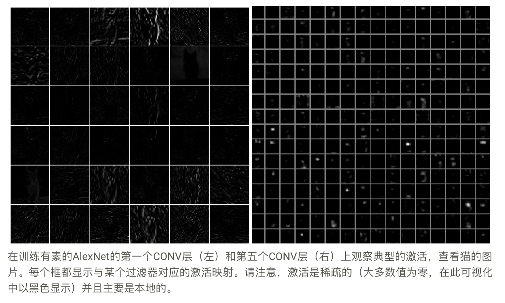
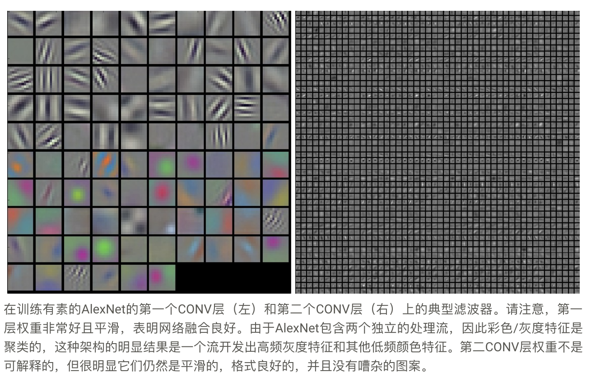
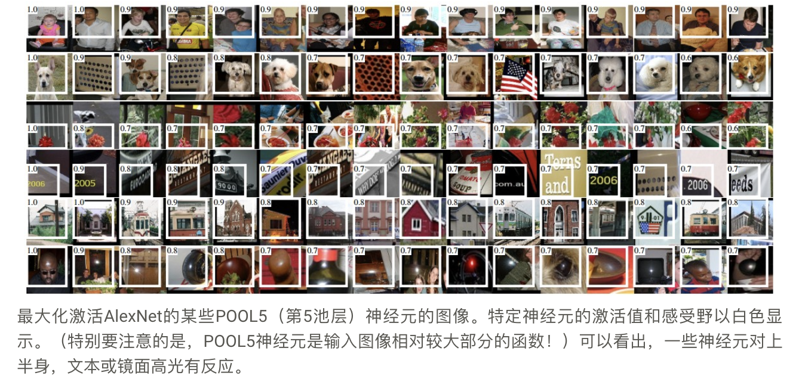
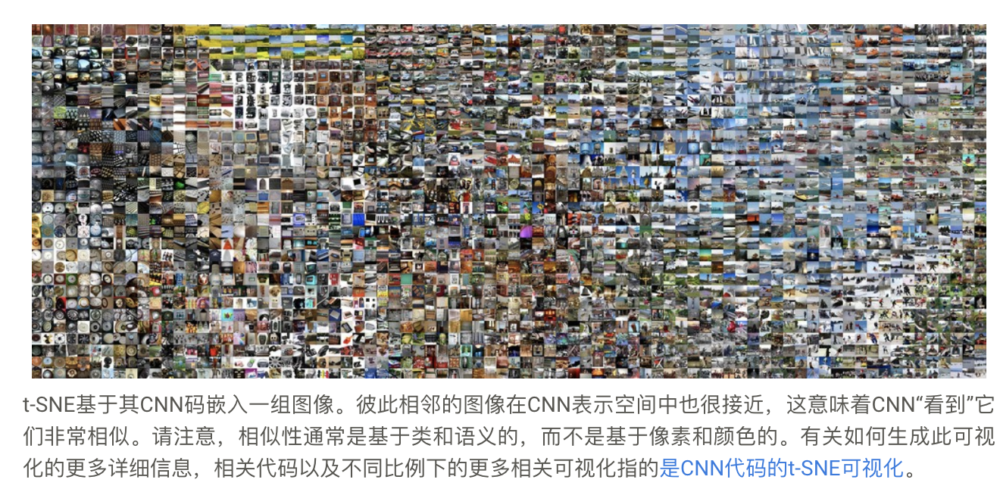
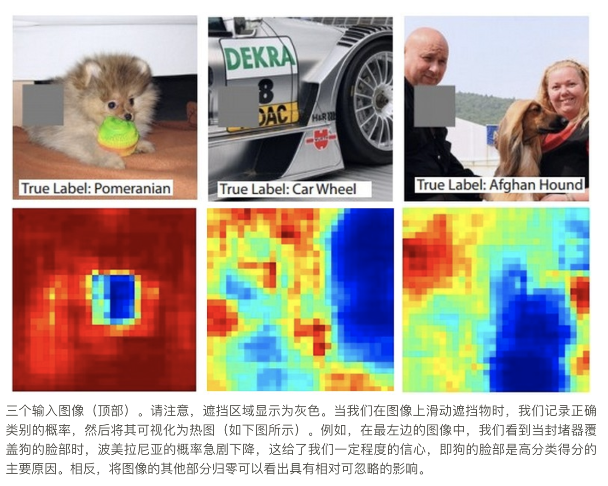

# 可视化ConvNets学习的内容

## 1. 可视化激活和第一层权重

1. 图层激活
    最直接的可视化技术是在前向传递过程中显示网络的激活。对于ReLU网络来说，激活通常开始看起来相对斑点和密集，但随着训练的进行，激活通常变得更加稀疏和局部化。这种可视化可以很容易地注意到的一个危险的陷阱是，对于许多不同的输入，一些激活图可能全为零，这可以指示死滤波器，并且可以是高学习率的症状。
    
2. conv/fc 过滤器
    这些通常在第一个直接查看原始像素数据的CONV层上可解释，但也可以在网络中更深地显示滤波器权重。权重对于可视化是有用的，**因为训练有素的网络通常显示漂亮且平滑的滤波器而没有任何噪声模式。噪声模式可以是未经过足够长时间训练的网络的指示，或者可能是导致过度拟合的非常低的正则化强度。**
    

## 2. 检索最大程度激活神经元的图像

另一种可视化技术是获取大量图像数据，通过网络提供它们并跟踪哪些图像最大程度地激活某些神经元。然后，我们可以对图像进行可视化，以了解神经元在其感知领域中正在寻找什么。

这种方法的一个问题是ReLU神经元本身不一定具有任何语义含义。相反，将多个ReLU神经元视为图像块中表示的某些空间的基础向量更为合适。换句话说，可视化显示沿着与滤波器权重对应的（任意）轴的表示云边缘处的块。这也可以通过ConvNet中的神经元在输入空间上线性运行这一事实来看出，因此该空间的任意旋转都是无操作。Szegedy等人在神经网络的奇异属性中进一步论证了这一点，他们在表示空间中沿任意方向执行类似的可视化。

## 3. 使用t-SNE嵌入代码

ConvNets可以解释为逐渐将图像转换为表示，其中类可以通过线性分类器分离。通过将图像嵌入到二维中，我们可以粗略地了解该空间的拓扑结构，使得它们的低维表示具有与其高维表示大致相等的距离。已经开发了许多嵌入方法，其具有在低维空间中嵌入高维向量的直觉，同时保持点的成对距离。其中，t-SNE是最着名的方法之一，始终如一地产生视觉上令人愉悦的结果。

为了产生嵌入，我们可以采用一组图像并使用ConvNet来提取CNN代码（例如，在分类器之前的AlexNet 4096维向量中，并且至关重要的是，包括ReLU非线性）。然后我们可以将它们插入t-SNE并获得每个图像的二维矢量。相应的图像可以在网格中可视化

## 4. 遮挡部分图像

假设ConvNet将图像分类为狗。我们如何确定它实际上是在图像中捕捉到了狗，而不是来自背景或其他一些杂项对象的某些情境线索呢？调查某些分类预测来自图像的哪个部分的一种方法是通过将感兴趣类别（例如，狗类）的概率绘制为遮挡物体的位置的函数。也就是说，我们迭代图像的区域，将图像的补丁设置为全零，并查看类的概率。我们可以将概率可视化为二维热图.

